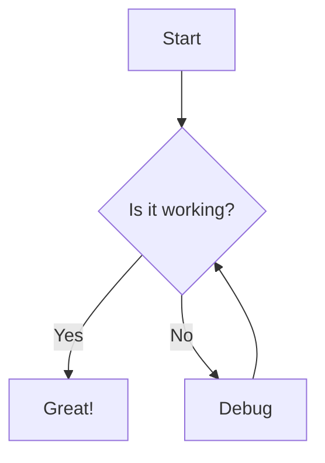
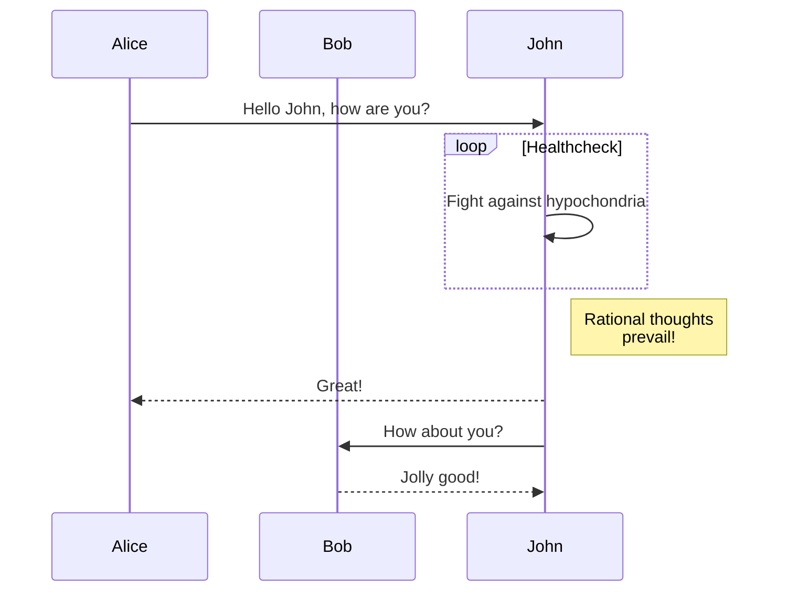
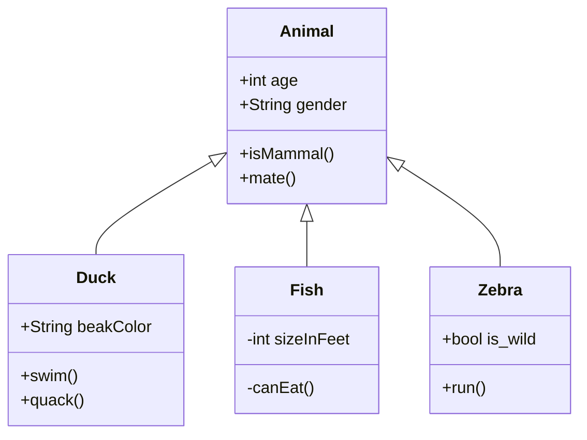

This is my first blog post. I'm excited to share my thoughts, experiences, and knowledge with you through this platform.

## What to Expect

On this blog, I'll be writing about:

- Technology trends and insights
- Programming tutorials and tips
- Personal projects and experiments
- Book reviews and learning resources

## Code Examples

Here's a Kotlin configuration class:

```kotlin
@EnableAsync
@Configuration
class AsyncConfiguration
```

Here's a Java example:

```java
public class HelloWorld {
    public static void main(String[] args) {
        System.out.println("Hello, World!");
    }
}
```

Here's a Python example:

```python
def greet(name):
    return f"Hello, {name}!"

print(greet("World"))
```

Here's a JavaScript example:

```javascript
function greet(name) {
    return `Hello, ${name}!`;
}

console.log(greet("World"));
```

## Images

You can also include images in your posts:


## Blockquotes

> The best way to predict the future is to invent it.
> 
> — Alan Kay

## Lists

### Unordered List

- Item 1
- Item 2
- Item 3

### Ordered List

1. First item
2. Second item
3. Third item

## Tables

| Name     | Age | Occupation    |
|----------|-----|---------------|
| John Doe | 30  | Developer     |
| Jane Doe | 28  | Designer      |
| Bob Smith| 35  | Project Manager |

## Mermaid Diagrams

Mermaid is a JavaScript-based diagramming and charting tool that renders Markdown-inspired text definitions to create diagrams.

### Flowchart



### Sequence Diagram



### Class Diagram



## Conclusion

I hope you'll find the content on this blog useful and engaging. Feel free to leave comments and share your thoughts!

Stay tuned for more posts coming soon.
